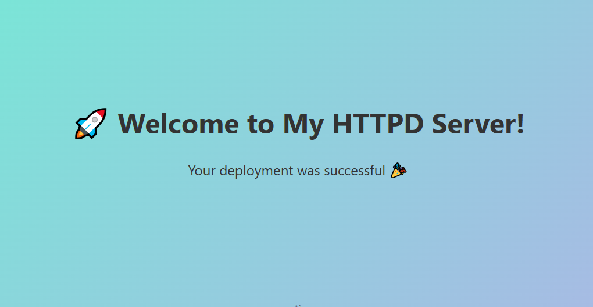

# kubernetes-ebs-pv-pvc-demo
Kubernetes Static Provisioning Demo using AWS EBS Volumes, Persistent Volumes, and Persistent Volume Claims.


---

# 📦 Kubernetes EBS Static Provisioning Demo

> **A complete project showcasing Persistent Volume (PV) + Persistent Volume Claim (PVC) usage with AWS EBS in Kubernetes (EKS Cluster).**

---

## 🚀 Project Overview

In Kubernetes, **Pods are ephemeral** — meaning, they can be recreated anytime, losing their local data.  
**Persistent Volumes (PV)** and **Persistent Volume Claims (PVC)** solve this real-world problem by providing **durable storage** independent of Pod lifecycles.

This project demonstrates:
- Creating static **EBS volumes** and linking them to **Kubernetes Pods**.
- Using the **AWS EBS CSI driver** for seamless EBS integration.
- Hosting a simple **HTTPD server** mounted with persistent storage.
- Exposing the Pod externally with a **LoadBalancer Service**.

---

## 🛠️ Tech Stack

| Technology | Purpose |
|:-----------|:--------|
| **Kubernetes** | Orchestrating and managing resources |
| **Amazon EKS** | Kubernetes cluster hosting |
| **Amazon EBS** | Persistent storage backend |
| **AWS EBS CSI Driver** | Dynamic connection between Kubernetes and EBS |
| **Apache HTTPD** | Simple web server for demonstration |
| **eksctl** | Cluster setup and nodegroup management |

---

## 📋 Project Structure

```
.
├── 001-clustersetup.yaml      # EKS Cluster setup with Spot nodes and IAM Policies
├── 1-ebs-static.yaml          # PV + PVC + Pod + Service manifest
├── README.md                  # You are here!
└── 1.PNG                      # Deployment Screenshot
```

---

## 🧠 Key Concepts

- **PersistentVolume (PV):**  
  Pre-provisioned piece of storage inside the cluster (AWS EBS Volume).

- **PersistentVolumeClaim (PVC):**  
  Request made by Pods to use specific storage without worrying about its physical details.

- **EBS CSI Driver:**  
  Kubernetes standard way to manage AWS EBS Volumes dynamically and securely.

---

## ⚡ Setup Instructions

### 1. Create EKS Cluster

```bash
eksctl create cluster -f 001-clustersetup.yaml
```

This will:
- Create an EKS cluster
- Add managed Spot nodegroups
- Automatically attach IAM policies for **EBS** and **AutoScaling**

---

### 2. Deploy AWS EBS CSI Driver

```bash
kubectl apply -k "github.com/kubernetes-sigs/aws-ebs-csi-driver/deploy/kubernetes/overlays/stable/?ref=release-1.42"
```

---

### 3. Create EBS Volume in AWS

- Go to AWS Console ➔ EC2 ➔ Elastic Block Store ➔ Volumes ➔ Create Volume
- Note down the **Volume ID** (e.g., `vol-xxxxxxxxxxxxxx`)

---

### 4. Apply Kubernetes Storage and App Manifests

```bash
kubectl apply -f 1-ebs-static.yaml
```

This will:
- Create a **PersistentVolume** (PV) linked to your EBS Volume.
- Create a **PersistentVolumeClaim** (PVC).
- Deploy a **Pod** running **httpd** server.
- Expose it externally using a **LoadBalancer Service**.

---

### 5. Access Your Application

Find your LoadBalancer IP:

```bash
kubectl get svc fb-srv
```

Visit in browser:

```
http://<LoadBalancer-IP>
```

You will see your **HTTPD server** serving content stored on **EBS Volume**! 🚀

---

## 🎯 Architecture Diagram

```plaintext
User ---> LoadBalancer Service ---> Pod (HTTPD Server)
                      │
                      ↓
          PersistentVolumeClaim (PVC)
                      ↓
          PersistentVolume (PV)
                      ↓
                AWS EBS Volume
```

---

## 📸 Demo Screenshot



---

## 📚 Real-World Use Cases

- Running **stateful applications** (databases, CMS) on Kubernetes.
- Ensuring **data persistence** across Pod rescheduling and crashes.
- Automating storage provisioning in **production-ready clusters**.

---

## ✨ Future Enhancements

- Dynamic provisioning using **StorageClass**.
- Implement **PodDisruptionBudgets (PDB)** for HA.
- Setup **Cluster Autoscaler** for intelligent node scaling.

---

## 🤝 Connect with Me

- 🔗 [LinkedIn Profile](#)
- 📦 [More Projects on GitHub](#)

---

# 🚀 Happy Kubernetes-ing! 🚀

---

  
